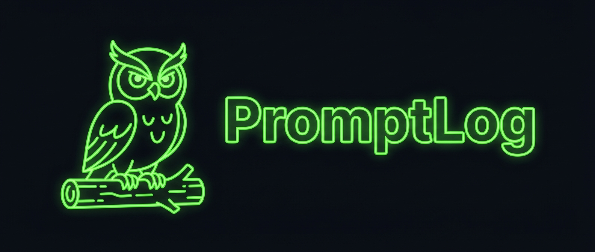
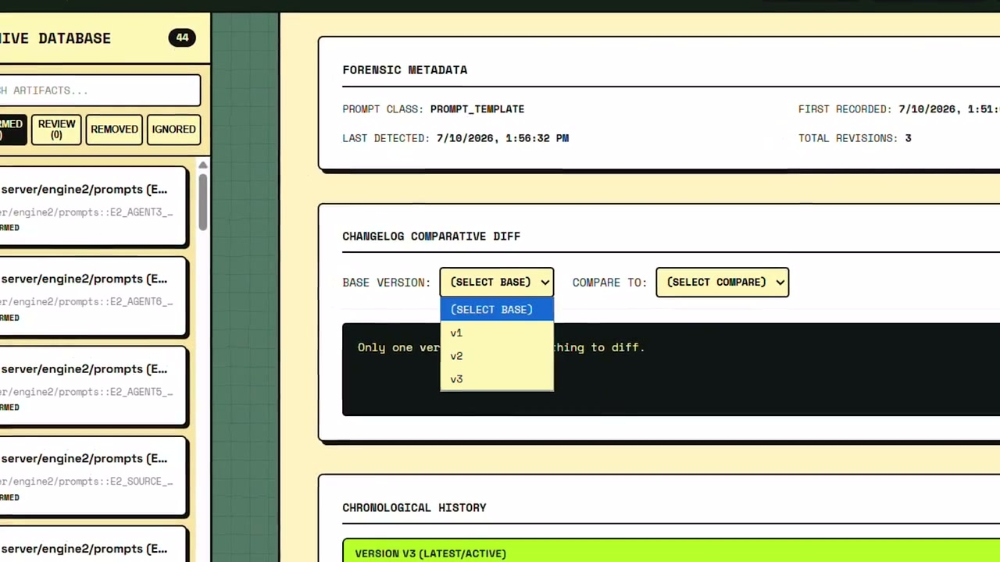

<p align="center"></p>

<p align="center">
<a href="https://github.com/shrimaanshreyash/Promptlog/actions/workflows/ci.yml"></a>
<a href="./LICENSE"></a>
<a href="https://nodejs.org"></a>
<a href="./CONTRIBUTING.md"></a>
</p>

Permanent prompt memory, visual diffs, and human notes for AI applications.

PromptLog scans your codebase for LLM prompts, tracks every change as a versioned snapshot, and gives you a local dashboard to compare diffs, add human notes, and rollback when things break.

<p align="center">
  <a href=".github/assets/promptlog-demo.mp4">
    
  </a>
</p>

<p align="center"><strong><a href=".github/assets/promptlog-demo.mp4">Watch the 2-minute PromptLog demo</a></strong></p>

## Why

Prompts are the most important part of your AI app, but they live as strings in code with no version history, no audit trail, and no way to see what changed when your model started behaving differently. PromptLog fixes that.

## Features

- **Auto-detection** — Scans JS/TS, Python, YAML, JSON, Markdown, and `.env` files for prompts using 8+ detection layers
- **Claude semantic audit** — The Claude Code plugin traces values from real model calls, compares them with the local inventory, and asks before registering anything the deterministic scanner missed
- **Version tracking** — Every prompt change creates a new version with content hash, git metadata, and file location
- **Visual diffs** — Word-level diffs between any two versions, in the CLI or the dashboard
- **File watcher** — Real-time monitoring with incremental scanning on save
- **Human notes** — Annotate any prompt version with issues, benefits, risks, change reasons, or test results. List, filter, search, and bulk-delete from CLI or dashboard
- **Local dashboard** — Retro-styled web UI for browsing prompts, comparing versions, and managing notes
- **Rollback** — Generate rollback patches or apply older prompt versions directly
- **Export** — Export full prompt history to Markdown or JSON
- **Stable tracking** — Prompts are identified by name, not line number, so they survive refactors and line shifts
- **Manual registration** — Manually track prompts the scanner can't detect
- **Security** — Dashboard binds to localhost only by default

## Install

Choose the interface you use. Both run the same local PromptLog engine and keep project history under `.promptlog/`.

### CLI

Install the standalone `plog` command:

```bash
npm install -g @srimaanshreyas/plog
```

### Claude Code Plugin

Add the custom marketplace and install PromptLog:

```
/plugin marketplace add shrimaanshreyash/Promptlog
/plugin install plog@promptlog
/reload-plugins
```

The plugin includes its own CLI runtime. A separate global npm installation is not required for Claude Code usage.

Run the namespaced command from any project:

```text
/plog:plog init
/plog:plog scan
/plog:plog audit
```

- `init` creates the local database, performs the first deterministic scan, and runs a repository-aware semantic audit.
- `scan` records deterministic changes and then compares that inventory with prompt-bearing values traced from real model calls.
- `audit` reruns only the Claude semantic comparison. It reports missed and uncertain prompt surfaces and asks before manually registering anything.

The same command accepts every CLI operation, for example `/plog:plog status`, `/plog:plog diff <id> --latest`, and `/plog:plog note <id> ...`. A plain-language request such as `/plog:plog check what changed` is mapped to the closest action.

To update an existing installation:

```text
/plugin marketplace update promptlog
/plugin update plog@promptlog
/reload-plugins
```

Prompt contents are not sent to a separate PromptLog service. The deterministic scanner is local; the optional semantic audit uses the active Claude Code session and respects the project intelligence settings in `.promptlog/config.json`.

## Quick Start

```bash
# Initialize in your project
cd your-ai-project
plog init

# Scan for prompts
plog scan

# Start the dashboard
plog ui

# Watch for changes in real time
plog watch
```

## Commands

| Command | Description |
|---------|-------------|
| `plog init` | Initialize PromptLog in the current project |
| `plog scan` | Scan for prompts and record new versions |
| `plog watch` | Watch files and auto-detect prompt changes |
| `plog ui` | Start the local dashboard (default: port 4319) |
| `plog status` | Show prompt counts and recent activity |
| `plog inventory [--json]` | List tracked prompt locations without exposing prompt content |
| `plog diff <id>` | Show word-level diff between prompt versions |
| `plog note <id>` | Add a human note to a prompt version |
| `plog notes <id>` | List all notes for a prompt (supports `--type`, `--severity`, `--version` filters) |
| `plog note-delete <noteId>` | Delete a note by ID (prefix match supported) |
| `plog export` | Export prompt history to Markdown/JSON |
| `plog rollback <id> <version>` | Rollback a prompt to an older version |
| `plog add <file>` | Manually register a prompt the scanner missed |
| `plog ignore <id>` | Stop tracking a prompt |
| `plog unignore <id>` | Resume tracking a previously ignored prompt |
| `plog config get/set` | Read or update configuration |

## Global Flags

| Flag | Description |
|------|-------------|
| `--verbose` | Enable verbose output for debugging |
| `--quiet` | Suppress all non-essential output |

## Dashboard Options

```bash
plog ui --port 5000        # Custom port
plog ui --host 0.0.0.0     # Expose to network (default: localhost only)
plog ui --no-open           # Don't auto-open browser
```

## What It Detects

PromptLog finds prompts across multiple languages and patterns:

- **JS/TS**: Named variables (`systemPrompt`, `AGENT_INSTRUCTIONS`), `role: "system"` objects, Vercel AI SDK calls, prompt builder functions, record/dictionary literals
- **Python**: Triple-quoted prompt variables, system message tuples, prompt builder functions
- **YAML**: `system:`, `prompt:`, `instructions:`, `template:` keys
- **JSON**: Prompt fields and messages arrays
- **Markdown**: CLAUDE.md, AGENTS.md, Cursor rules, Copilot instructions
- **`.env`**: Variables with PROMPT, INSTRUCTION, TEMPLATE, or SYSTEM_MESSAGE in the name

### Manual Registration

If the scanner misses a prompt (rare), register it manually:

```bash
plog add src/hidden-prompt.ts --start 10 --end 25 --name myPrompt
```

Manually registered prompts are tracked by scan and watch just like auto-detected ones.

## Human Notes

Annotate any prompt version with structured notes. Six note types are available: `general_note`, `reason`, `issue`, `benefit`, `test_result`, and `risk`. Each note can carry a severity level: `none`, `low`, `medium`, `high`, or `critical`.

```bash
# Add a note
plog note "prompts::systemPrompt" --title "Regression risk" --body "Removing the JSON constraint may break downstream parsers" --type risk --severity high

# List notes for a prompt
plog notes "prompts::systemPrompt"

# Filter by type or severity
plog notes "prompts::systemPrompt" --type issue
plog notes "prompts::systemPrompt" --severity critical

# Target a specific version
plog note "prompts::systemPrompt" --version v2 --title "Why we changed this" --type reason

# Delete a note by ID (prefix match works)
plog note-delete 8f10e9e1
```

The dashboard also supports creating, editing, selecting, and bulk-deleting notes. The `plog status` command shows how many prompt versions have no notes yet, so you know what still needs annotation.

### Notes API

The server exposes a global search endpoint for notes across all prompts:

```
GET /api/notes/search?q=hallucinate&note_type=risk&severity=critical
```

Per-prompt notes support filtering:

```
GET /api/prompts/:id/notes?version_id=...&note_type=issue&severity=high
```

## File Watcher

The watcher uses incremental scanning — only changed files are re-scanned, not the entire project.

For Docker, WSL, or network filesystems where native file events don't work:

```bash
PROMPTLOG_POLL=1 plog watch
```

## Configuration

PromptLog stores config at `.promptlog/config.json`. Key options:

```json
{
  "scanner": {
    "include": ["src/**/*", "server/**/*", "lib/**/*"],
    "exclude": ["node_modules/**", "dist/**"],
    "confidenceThreshold": "low"
  },
  "ui": {
    "defaultPort": 4319
  }
}
```

## Requirements

- Node.js >= 22.13
- npm

## License

MIT
